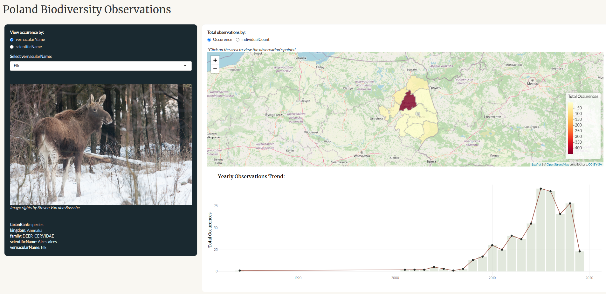

# Poland's Biodiversity Shiny Application

 
Please click on this [link](https://tangerine.shinyapps.io/biodiversity-pol/) to access the application on shinyapps.io!

This app lets you observe reported species in Poland area from biodiversity data collected by [Global Biodiversity Information Facility](https://www.gbif.org/occurrence/search?dataset_key=8a863029-f435-446a-821e-275f4f641165) (The raw data was shared on this [gdrive](https://drive.google.com/file/d/1l1ymMg-K_xLriFv1b8MgddH851d6n2sU/view?usp=sharing)). However, to improve app performance, the app is read the cleaned .RDS format of the data.frame which stored under `/data` directory. Functions that is used on the data pre-processing can be accessed on [data/function_clean_csv.R](data/function_clean_csv.R).

## Requirements

This app is built under R version 4.1.2. The list of R libraries that is used for the development are:

- [Shiny](https://shiny.rstudio.com/)
- [dplyr](https://dplyr.tidyverse.org/)
- [sf](https://r-spatial.github.io/sf/)
- [leaflet](https://rstudio.github.io/leaflet/)
- [htmltools](https://github.com/rstudio/htmltools)
- [ggplot2](https://ggplot2.tidyverse.org/)
- [plotly](https://plotly.com/r/)
- [glue](https://glue.tidyverse.org/)